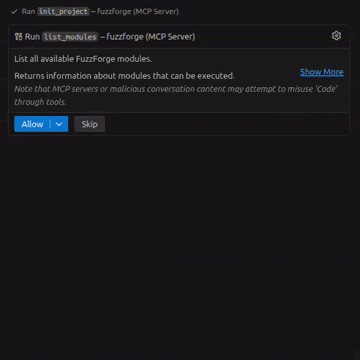
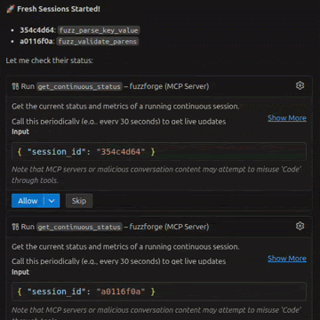

<h1 align="center"> FuzzForge AI</h1>
<h3 align="center">AI-Powered Security Research Orchestration via MCP</h3>

<p align="center">
  <a href="https://discord.gg/8XEX33UUwZ"></a>
  <a href="LICENSE"></a>
  <a href="https://www.python.org/downloads/"></a>
  <a href="https://modelcontextprotocol.io"></a>
  <a href="https://fuzzforge.ai"></a>
</p>

<p align="center">
  <strong>Let AI agents orchestrate your security research workflows locally</strong>
</p>

<p align="center">
  <sub>
    <a href="#-overview"><b>Overview</b></a> •
    <a href="#-features"><b>Features</b></a> •
    <a href="#-installation"><b>Installation</b></a> •
    <a href="USAGE.md"><b>Usage Guide</b></a> •
    <a href="#-modules"><b>Modules</b></a> •
    <a href="#-contributing"><b>Contributing</b></a>
  </sub>
</p>

---

> 🚧 **FuzzForge AI is under active development.** Expect breaking changes and new features!

---

## 🚀 Overview

**FuzzForge AI** is an open-source runtime that enables AI agents (GitHub Copilot, Claude, etc.) to orchestrate security research workflows through the **Model Context Protocol (MCP)**.

### The Core: Modules

At the heart of FuzzForge are **modules** - containerized security tools that AI agents can discover, configure, and orchestrate. Each module encapsulates a specific security capability (static analysis, fuzzing, crash analysis, etc.) and runs in an isolated container.

- **🔌 Plug & Play**: Modules are self-contained - just pull and run
- **🤖 AI-Native**: Designed for AI agent orchestration via MCP
- **🔗 Composable**: Chain modules together into automated workflows
- **📦 Extensible**: Build custom modules with the Python SDK

FuzzForge AI handles module discovery, execution, and result collection. Security modules (developed separately) provide the actual security tooling - from static analyzers to fuzzers to crash triagers.

Instead of manually running security tools, describe what you want and let your AI assistant handle it.

### 🎬 Use Case: Rust Fuzzing Pipeline

> **Scenario**: Fuzz a Rust crate to discover vulnerabilities using AI-assisted harness generation and parallel fuzzing.

<table align="center">
  <tr>
    <th>1️⃣ Analyze, Generate & Validate Harnesses</th>
    <th>2️⃣ Run Parallel Continuous Fuzzing</th>
  </tr>
  <tr>
    <td></td>
    <td></td>
  </tr>
  <tr>
    <td align="center"><sub>AI agent analyzes code, generates harnesses, and validates they compile</sub></td>
    <td align="center"><sub>Multiple fuzzing sessions run in parallel with live metrics</sub></td>
  </tr>
</table>

---

## ⭐ Support the Project

If you find FuzzForge useful, please **star the repo** to support development! 🚀

<a href="https://github.com/FuzzingLabs/fuzzforge_ai/stargazers">
  
</a>

---

## ✨ Features

| Feature | Description |
|---------|-------------|
| 🤖 **AI-Native** | Built for MCP - works with GitHub Copilot, Claude, and any MCP-compatible agent |
| 📦 **Containerized** | Each module runs in isolation via Docker or Podman |
| 🔄 **Continuous Mode** | Long-running tasks (fuzzing) with real-time metrics streaming |
| 🔗 **Workflows** | Chain multiple modules together in automated pipelines |
| 🛠️ **Extensible** | Create custom modules with the Python SDK |
| 🏠 **Local First** | All execution happens on your machine - no cloud required |
| 🔒 **Secure** | Sandboxed containers with no network access by default |

---

## 🏗️ Architecture

```
┌─────────────────────────────────────────────────────────────────┐
│                     AI Agent (Copilot/Claude)                   │
└───────────────────────────┬─────────────────────────────────────┘
                            │ MCP Protocol (stdio)
                            ▼
┌─────────────────────────────────────────────────────────────────┐
│                     FuzzForge MCP Server                        │
│  ┌─────────────┐  ┌──────────────┐  ┌────────────────────────┐  │
│  │list_modules │  │execute_module│  │start_continuous_module │  │
│  └─────────────┘  └──────────────┘  └────────────────────────┘  │
└───────────────────────────┬─────────────────────────────────────┘
                            │
                            ▼
┌─────────────────────────────────────────────────────────────────┐
│                     FuzzForge Runner                            │
│                  Container Engine (Docker/Podman)               │
└───────────────────────────┬─────────────────────────────────────┘
                            │
        ┌───────────────────┼───────────────────┐
        ▼                   ▼                   ▼
┌───────────────┐   ┌───────────────┐   ┌───────────────┐
│  Module A     │   │  Module B     │   │  Module C     │
│  (Container)  │   │  (Container)  │   │  (Container)  │
└───────────────┘   └───────────────┘   └───────────────┘
```

---

## 📦 Installation

### Prerequisites

- **Python 3.12+**
- **[uv](https://docs.astral.sh/uv/)** package manager
- **Docker** ([Install Docker](https://docs.docker.com/get-docker/)) or Podman

### Quick Install

```bash
# Clone the repository
git clone https://github.com/FuzzingLabs/fuzzforge_ai.git
cd fuzzforge_ai

# Install dependencies
uv sync

# Build module images
make build-modules
```

### Configure MCP for Your AI Agent

```bash
# For GitHub Copilot
uv run fuzzforge mcp install copilot

# For Claude Code (CLI)
uv run fuzzforge mcp install claude-code

# For Claude Desktop (standalone app)
uv run fuzzforge mcp install claude-desktop

# Verify installation
uv run fuzzforge mcp status
```

**Restart your editor** and your AI agent will have access to FuzzForge tools!

---

## 📦 Modules

FuzzForge modules are containerized security tools that AI agents can orchestrate. The module ecosystem is designed around a simple principle: **the OSS runtime orchestrates, enterprise modules execute**.

### Module Ecosystem

| | FuzzForge AI | FuzzForge Enterprise Modules |
|---|---|---|
| **What** | Runtime & MCP server | Security research modules |
| **License** | Apache 2.0 | BSL 1.1 (Business Source License) |
| **Compatibility** | ✅ Runs any compatible module | ✅ Works with FuzzForge AI |

**Enterprise modules** are developed separately and provide production-ready security tooling:

| Category | Modules | Description |
|----------|---------|-------------|
| 🔍 **Static Analysis** | Rust Analyzer, Solidity Analyzer, Cairo Analyzer | Code analysis and fuzzable function detection |
| 🎯 **Fuzzing** | Cargo Fuzzer, Honggfuzz, AFL++ | Coverage-guided fuzz testing |
| 💥 **Crash Analysis** | Crash Triager, Root Cause Analyzer | Automated crash deduplication and analysis |
| 🔐 **Vulnerability Detection** | Pattern Matcher, Taint Analyzer | Security vulnerability scanning |
| 📝 **Reporting** | Report Generator, SARIF Exporter | Automated security report generation |

> 💡 **Build your own modules!** The FuzzForge SDK allows you to create custom modules that integrate seamlessly with FuzzForge AI. See [Creating Custom Modules](#-creating-custom-modules).

### Execution Modes

Modules run in two execution modes:

#### One-shot Execution

Run a module once and get results:

```python
result = execute_module("my-analyzer", assets_path="/path/to/project")
```

#### Continuous Execution

For long-running tasks like fuzzing, with real-time metrics:

```python
# Start continuous execution
session = start_continuous_module("my-fuzzer", 
    assets_path="/path/to/project",
    configuration={"target": "my_target"})

# Check status with live metrics
status = get_continuous_status(session["session_id"])

# Stop and collect results
stop_continuous_module(session["session_id"])
```

---

## 🛠️ Creating Custom Modules

Build your own security modules with the FuzzForge SDK:

```python
from fuzzforge_modules_sdk import FuzzForgeModule, FuzzForgeModuleResults

class MySecurityModule(FuzzForgeModule):
    def _run(self, resources):
        self.emit_event("started", target=resources[0].path)
        
        # Your analysis logic here
        results = self.analyze(resources)
        
        self.emit_progress(100, status="completed", 
            message=f"Analysis complete")
        return FuzzForgeModuleResults.SUCCESS
```

📖 See the [Module SDK Guide](fuzzforge-modules/fuzzforge-modules-sdk/README.md) for details.

---

## 📁 Project Structure

```
fuzzforge_ai/
├── fuzzforge-cli/           # Command-line interface
├── fuzzforge-common/        # Shared abstractions (containers, storage)
├── fuzzforge-mcp/           # MCP server for AI agents
├── fuzzforge-modules/       # Security modules
│   └── fuzzforge-modules-sdk/   # Module development SDK
├── fuzzforge-runner/        # Local execution engine
├── fuzzforge-types/         # Type definitions & schemas
└── demo/                    # Demo projects for testing
```

---

## 🗺️ What's Next

**[MCP Security Hub](https://github.com/FuzzingLabs/mcp-security-hub) integration** — Bridge 175+ offensive security tools (Nmap, Nuclei, Ghidra, and more) into FuzzForge workflows, all orchestrated by AI agents.

See [ROADMAP.md](ROADMAP.md) for the full roadmap.

---

## 🤝 Contributing

We welcome contributions from the community!

- 🐛 Report bugs via [GitHub Issues](../../issues)
- 💡 Suggest features or improvements
- 🔧 Submit pull requests
- 📦 Share your custom modules

See [CONTRIBUTING.md](CONTRIBUTING.md) for guidelines.

---

## 📄 License

BSL 1.1 - See [LICENSE](LICENSE) for details.

---

<p align="center">
  <strong>Maintained by <a href="https://fuzzinglabs.com">FuzzingLabs</a></strong>
  <br>
</p>